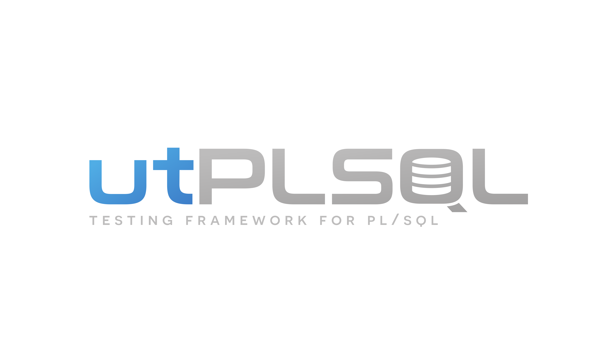

# utPLSQL-logo
Logo for utPLSQL projects family

## Logo with "TESTING FRAMEWORK FOR PL/SQL" slogan

Transparent background

White background

Black background

## Logo with "TEST YOUR PL/SQL" slogan

Transparent background

White background

Black background

## Logo without slogan

Transparent background

White background

Black background

## The Q icon

Transparent background

White background

Black background

## The Q icon - blue gradient

Transparent background

White background

Black background

## Note

> Base font used for logo is `Neuropolitical` 
